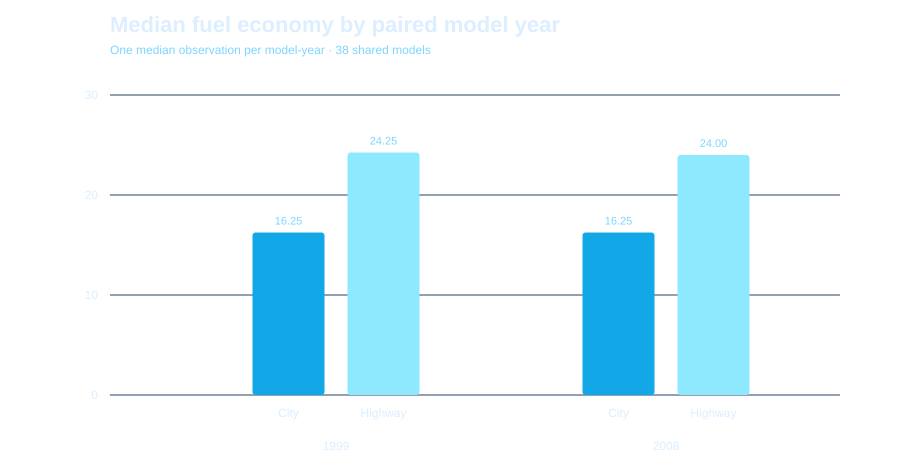
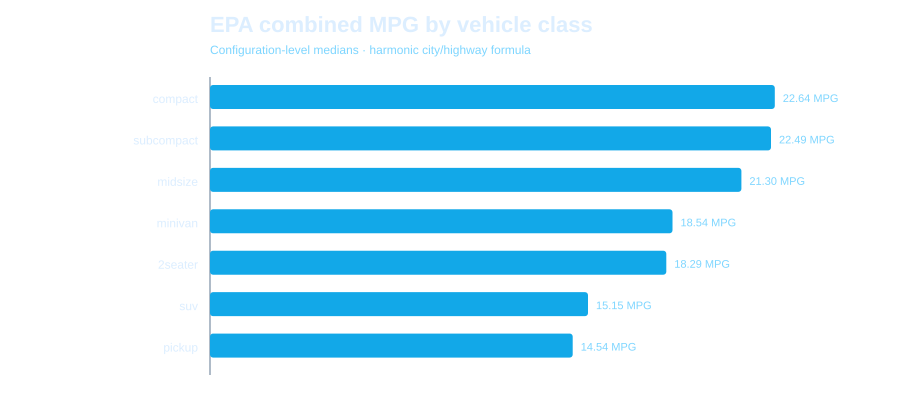

# Fleet Efficiency Benchmark

A historical vehicle-efficiency analysis using an EPA-derived sample of popular 1999 and 2008 models. The project focuses on procurement-style benchmarking, fuel-intensity proxies and honest interpretation of a limited comparison sample.

## Overview

Fuel efficiency affects operating cost, emissions exposure and fleet suitability. This repository builds a reproducible analytical layer around a compact, well-documented EPA-derived dataset and demonstrates SQL-first business analysis without forcing machine learning where it does not add value.

## Business Problem

A fleet analyst needs to compare vehicle classes and basic technical attributes before deeper total-cost-of-ownership work. The goal is to identify efficiency trade-offs and to avoid assuming that newer model year alone guarantees better fuel economy within a selected sample.

## Dataset

`plotnine.data.mpg` — **234 rows and 11 source variables**, documented as a subset of EPA fuel-economy data for 38 popular models from 1999 and 2008.

- Documentation: https://plotnine.org/reference/mpg.html
- Original provenance: U.S. EPA / fueleconomy.gov
- EPA open-data license: https://edg.epa.gov/EPA_Data_License.html
- Raw input is materialized by `python scripts/download_data.py` and is not committed.

See [`data/README.md`](data/README.md).

## Key Questions

- Which vehicle classes are most fuel efficient in this selected sample?
- How does engine displacement relate to highway MPG?
- Did the selected 2008 sample materially outperform the selected 1999 sample?
- Which manufacturers have the strongest efficiency benchmark after a minimum observation threshold?
- How much fuel intensity changes across displacement segments?

## Methodology

1. Standardize source columns and remove exact duplicates.
2. Apply basic validity checks.
3. Create a transparent weighted MPG proxy: `0.55 × city MPG + 0.45 × highway MPG`.
4. Convert the proxy to gallons per 100 miles for a cost-oriented interpretation.
5. Materialize SQLite tables and execute SQL rankings/segments.
6. Use a Mann–Whitney test to compare the two model-year distributions without assuming normality.
7. Produce static figures and executed notebooks.

The weighted MPG measure is a project-specific analytical proxy and **not an official EPA combined MPG rating**.

## Tech Stack

Python · pandas · NumPy · SciPy · SQLite · SQL · Matplotlib · plotnine · pytest · GitHub Actions

## Data Cleaning

The source contained **234 rows**. The pipeline removed **9 exact duplicate rows**, leaving **225 analytical rows** with **0 source null cells**.

## Exploratory Data Analysis






## Key Insights

- Both model-year groups have a median highway MPG of **25** and median city MPG of **17** in this selected sample.
- The median weighted proxy is **20.50 MPG** for 1999 and **20.15 MPG** for 2008.
- The Mann–Whitney test returns **p = 0.503**; this sample does not provide statistically clear evidence of a shift in the proxy distribution at a 5% threshold.
- Compact vehicles have the highest median proxy (**23.15 MPG**) while pickups have the lowest (**14.80 MPG**).
- SQL displacement segments show average fuel intensity rising from about **3.63 gal/100 mi** below 2.0L to **6.19 gal/100 mi** at 3.0L and above.

## SQL Analysis

Executed SQL results are committed in [`reports/sql_results.md`](reports/sql_results.md). Queries demonstrate CTEs, `CASE WHEN`, aggregation, minimum-sample filtering and window-function ranking.


## Machine Learning

No ML model is included. The dataset is small, historical and better suited to comparative analysis than a portfolio model built only for appearance.

## Results

The main result is not “2008 is better.” Within this selected popular-model sample, model year alone does not separate the efficiency distributions clearly. Vehicle class, displacement and drivetrain provide more actionable segmentation for the exploratory fleet question.

## Business Recommendations

- Compare vehicles within class and duty requirements before using MPG as a procurement criterion.
- Use gallons per 100 miles alongside MPG when communicating operating-cost impact.
- Do not extrapolate the 1999/2008 teaching sample to a current rental fleet.
- For a production TCO model, extend with current vehicle price, real-world mileage, fuel prices, maintenance and depreciation.

## Repository Structure

```text
02-fleet-efficiency-benchmark/
├── README.md
├── data/README.md
├── notebooks/
├── scripts/
├── src/fleet_efficiency/
├── sql/
├── reports/
│   └── figures/
├── tests/
└── .github/workflows/ci.yml
```

## How to Run

```bash
python -m venv .venv
source .venv/bin/activate        # Windows: .venv\Scripts\activate
pip install -r requirements.txt
python scripts/download_data.py
python scripts/run_analysis.py --input data/raw/mpg.csv
pytest -q
```

## Data License

EPA states that its produced data are public domain unless otherwise specified. plotnine is MIT licensed and documents this dataset as EPA-derived. Repository source code and original written analysis are MIT licensed.

## Limitations

- Only selected popular models from 1999 and 2008 are included.
- The rows are vehicle/configuration observations, not fleet utilization records.
- The weighted MPG metric is an analyst-created proxy.
- EPA test-cycle MPG is not the same as real-world fleet fuel consumption.
- Results are descriptive associations, not causal effects.

## Future Improvements

- Replace the historical teaching subset with current official EPA vehicle-level files.
- Add fuel prices and annual mileage to estimate scenario-based operating cost.
- Compare powertrains and electrified vehicles using contemporary data.
- Add vehicle acquisition/resale data for a full TCO model.
